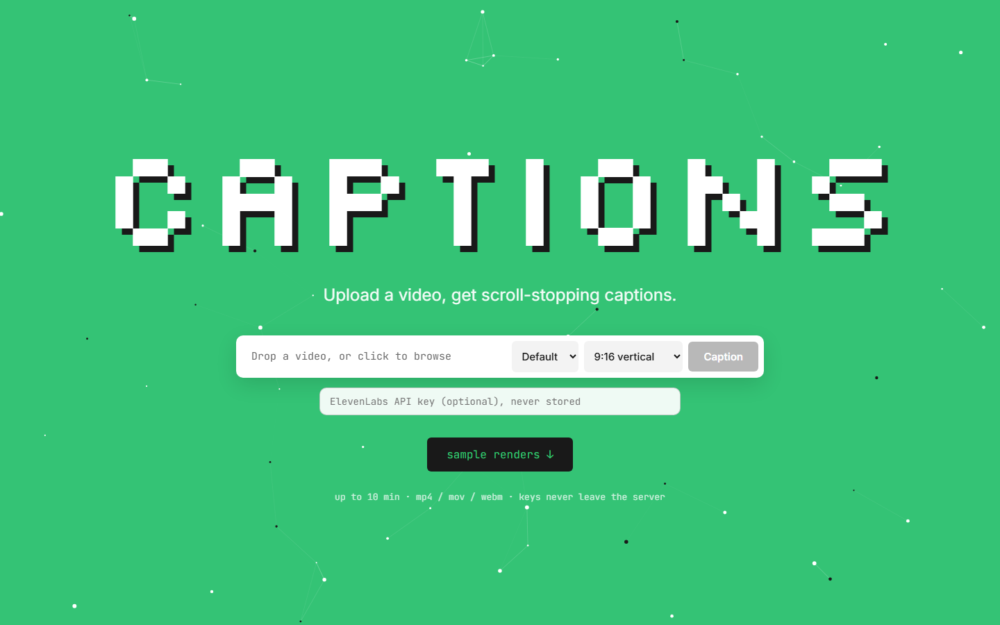

# captions



Upload a video, get scroll-stopping captions back as an MP4.

Built for the Glido Labs round 2 take-home. Captions transcribes a video word by word, splits it into short phrases, highlights each word as it is spoken, and renders the result with HyperFrames.

- Default: the look measured from the Eclipse reference reel. Key words in a bold display font, and one big word every few seconds behind the speaker's head.
- Custom: the same look with your highlight colour, one of three fonts, and words behind the speaker on or off.

```
upload > ffmpeg > ElevenLabs Scribe or Whisper > phrases and key words > speaker cut-out > HyperFrames > MP4
```

## Most impressive parts of this project

- Text behind the speaker works on any video. The speaker's head outline is tracked ten times a second, and each big word is placed against it using proportions measured once on the reference.
- The look was measured, not eyeballed. Fonts were matched by pixel comparison, colours sampled and timing tracked frame by frame. Our text lands within 4 to 20 pixels of the reference.
- It never fails silently. A big word that cannot go behind the speaker moves into the caption line, and the editor says why and offers a retry.
- Any video becomes a 9:16 reel, cropped around the speaker. Close-ups and empty shots are shown whole over a blurred fill.
- It was tested on clips it was never tuned on. The first run on three Creative Commons clips found five bugs, all fixed.
- Hinglish is spelled the way creators write it, matching all 55 Hindi words in the reference.
- It is careful with paid credits. Each video is transcribed once, long videos need confirmation, and the whole project used 1.6 minutes of audio.
- The preview is the render. The browser preview loads the same HTML that HyperFrames renders.

## Challenges faced during the project

- The first version was called generic. Instead of adjusting by eye, I measured the reference. An AI vision model's description of the style was wrong on font, colour, inactive words and outline, so it was not used.
- Matching fonts. Every candidate scored the same at first, because fonts loaded from file paths never rendered in headless Chrome. Embedding them fixed it, and Montserrat and Anton won clearly.
- Placement that only fit one video. The first version read the head from one frame and used fixed screen positions. Rewriting it around the outline in every frame made it work elsewhere.
- Renders that froze on an 8 GB laptop. Two causes looked like one: clip durations with floating point tails made the renderer wait for a frame that never came, and a long-running Chrome ran out of memory. Durations are now whole frames, and long videos are captured in 10 second segments.
- Unfamiliar clips. They exposed a crop centred on the wall between two people, a close-up blown up into a giant face, a cut-out model that returns nothing for extreme close-ups, an unusual frame rate, and words sharing one timestamp that were never highlighted.
- Fast talkers. Big words flashed for half a second. They now stay at least 0.9 seconds, the shortest in the reference, while the captions continue underneath.
- Hindi transcription. The transcriber returns Devanagari, so the romanizer needed rules for silent vowels, word-final long vowels, number words (barah becomes 12) and the danda.

## Quick start

You need Node 22 or later and ffmpeg on your PATH (`brew install ffmpeg`, `winget install Gyan.FFmpeg` or `sudo apt install ffmpeg`).

```bash
npm install
cp .env.example .env    # optional: ELEVENLABS_API_KEY or OPENAI_API_KEY
npm start               # http://localhost:3030
```

Without a key in `.env`, paste an ElevenLabs key on the upload page. It is used for that upload only and never stored, logged or returned.

After the first render, click a word to fix its spelling, or right-click to cycle it between normal, key word and big word. Re-rendering reuses the cached transcript.

## Command line

```bash
npm run caption -- samples/input/*.mp4 --out out/
npm run caption -- talk.mp4 --language hi --keyterms "Glido,FramesNFlights"
npm run caption -- talk.mp4 --accent "#ff4d6d" --font poppins --no-behind
```

| Flag | Effect |
|---|---|
| `--keyterms` | Brand names: spelled correctly, always key words, never behind the speaker |
| `--layout 9:16` or `original` | Default is 9:16 |
| `--accent`, `--font`, `--no-behind` | Custom look |
| `--yes` | Allow more than `MAX_STT_MINUTES` (default 5) of paid transcription |
| `--strict` | Fail if any big word could not go behind the speaker |
| `--no-render` | Stop after composing, for `tools/check.mjs` or `hyperframes snapshot` |

A `clip.transcript.json` next to `clip.mp4` is used instead of the API.

## How it works

| Step | File | What it does |
|---|---|---|
| Upload | `server/index.js` | Streams to disk with type and size checks. Plain `node:http`. |
| Audio | `server/pipeline.js` | Probes the video, extracts 16 kHz mono audio, crops to 9:16 |
| Transcribe | `server/transcribe.js` | ElevenLabs Scribe v2 or Whisper word timestamps, cached by audio hash |
| Chunk | `server/chunk.js` | Splits words into phrases |
| Roles | `server/roles.js` | Picks key words and big words |
| Cut out | `server/pipeline.js` | Removes the background, only while a big word is on screen |
| Compose | `server/pipeline.js` | Writes a HyperFrames project |
| Animate | `runtime/captions.js` | One GSAP timeline from the timestamps; places big words against the outline |
| Render | `hyperframes render` | Captures frames in headless Chrome and encodes the MP4 |

### Phrases

Boundaries come only from the transcript, so a 10 second clip and a 3 minute talk use the same code. A phrase ends at a pause over 350 ms, a sentence end, a comma after three words, or when it is full (four words, or the characters that fit on one line). Lines never end on weak words like "the", short leftovers are rebalanced, and words sharing a timestamp are spread one frame apart.

### The default look

| Element | Measured from the reference |
|---|---|
| Caption line | Montserrat Bold, 6.94 percent of the short edge, white, faint shadow, one to four words |
| Active word | `#FEE300` with a translucent yellow box |
| Key words | Anton capitals at 1.11 times line size, at least one per sentence of three or more words |
| Big words | Anton capitals at 29.8 percent of frame width, about one per 10 seconds, nouns, English words or numbers, never brands |

Full measurements are in [docs/eclipse-spec.md](docs/eclipse-spec.md). The look lives in `styles/default` (`style.json` and `style.css`), so changing it means editing data, not code. Custom is a validated set of overrides on it (`customizeStyle` in `server/pipeline.js`); each font is bundled with its measured glyph width so line breaking stays correct.

### Text behind the speaker

The head covers 55 percent of a long word's height; a short word such as a number tucks a third of its width behind the head. If the cut-out fails, finds nobody, or the head is too low or touches the top edge, the word goes into the caption line with a warning.

Background removal is the slowest step, so only the seconds with a big word are processed, in one model run, at half resolution with the mask applied to full-resolution frames. Results are cached.

### Hinglish

When the transcript contains Devanagari, `server/romanize.js` converts it to creator spellings (मैंने to maine, वालों to walon) using a dictionary plus rules.

## Testing

1. Unit tests (`npm test`, 30 tests): phrases, roles, romanizer, timestamps, custom style validation. No video or key needed.
2. Rule checks (`node tools/check.mjs jobs/<id>`) on any composed job: big words partly but never mostly hidden, every fallback explained, text inside the frame, the right word highlighted at each timestamp, a key word in every sentence.
3. Pixel comparison with the reference (`tools/measure/abtest.mjs`, `hyperframes snapshot --against`).

### Unseen clips

Tuned on the reference only, then run unchanged on Creative Commons clips from Wikimedia Commons (not committed): [Jacob Markstrom interview](https://commons.wikimedia.org/wiki/File:Jacob_Markstrom_interview_(1).webm) (rinkside93, CC BY 3.0), [Interview with Jeff Nippard](https://commons.wikimedia.org/wiki/File:Interview_with_Jeff_Nippard_%E2%80%93_Science_communication_and_neck_training_(science-based_bodybuilding).webm) (JPS Health & Fitness, CC BY 3.0), [Wikipedia 20, Darya and Avner](https://commons.wikimedia.org/wiki/File:Wikipedia_20_-_Darya_%26_Avner.webm) (Wikimedia Foundation, CC BY-SA 3.0).

| Clip | Hard because | 9:16 result | Big words behind | Highlight sync | Key words |
|---|---|---|---|---|---|
| Reference, reframed to landscape | Speaker off centre | Cropped on her head | 5 of 5 | 136 of 136 | 11 of 11 |
| Markstrom | Extreme close-up | Whole frame, blurred fill | 0 of 4, all moved to the line with a warning | 158 of 158 | 6 of 6 |
| Nippard | Two people, overlapping speech | Cropped on one person | 4 of 4 | 167 of 167 | 16 of 16 |
| Darya and Avner | Mostly cutaways | Cropped on the speaker | 1 of 1 | 37 of 37 | 4 of 4 |

### Checking against the reference

The reference reel is client footage and not in the repo. Put it in `reference/` (gitignored) and run:

```bash
npm run caption -- reference/eclipse.mp4 --keyterms "Astrotalk" --no-render
node tools/measure/abtest.mjs jobs/<job-id> reference/eclipse.mp4 22.9,27.0,28.9,46.0,47.9
npx hyperframes snapshot jobs/<job-id> --at 22.9,28.9,47.9 --against reference/eclipse.mp4
```

Three of the five big words match the reference's choices (PISCES, SPECIFICALLY, 12); the other two can be changed in the editor.

## Samples

`samples/output/` holds the two interview renders on the landing page ([credits](samples/CREDITS.md)). `samples/input/synthetic-portrait.mp4` ships with its transcript, so the pipeline runs without a key.

## Performance

On a 4-core i7-1165G7 with 8 GB of RAM, the 50 second reference renders in about 5 minutes. Background removal costs 15 to 45 seconds per second of big words on screen. Transcription takes seconds, once per video. HyperFrames' Lambda renderer is the next step for batch work.

## Security

- Server keys live only in the gitignored `.env` and never reach the browser.
- Uploads are limited by type and size (1 GB), then checked with ffprobe for a video stream and a 10 minute limit.
- Transcript edits change only word text and roles. Style settings are validated against fixed formats and a font allowlist before the upload is read.
- The server listens on 127.0.0.1 unless `HOST` is set.
- Uploads are re-encoded to H.264 with a keyframe every second, so phone HEVC files preview reliably.

## Decisions and trade-offs

| Choice | Reason | Alternative |
|---|---|---|
| HyperFrames | Plain HTML and GSAP, deterministic, Apache 2.0 | Remotion: React only, company licence |
| ElevenLabs Scribe v2 | Punctuated word timestamps, Hindi, key terms, about $0.22 per hour | Whisper, with punctuation re-attached |
| No framework, database or queue | Single-user tool with a handful of routes | A queue with Lambda rendering |
| Fixed 9:16 crop | Steadier than following the speaker | A smoothed panning crop |
